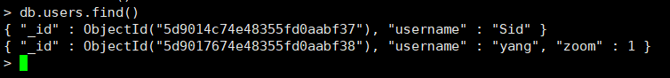
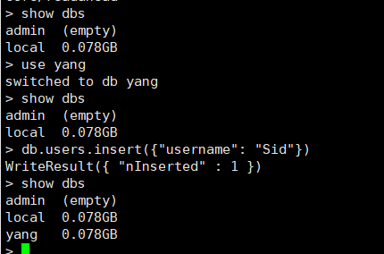
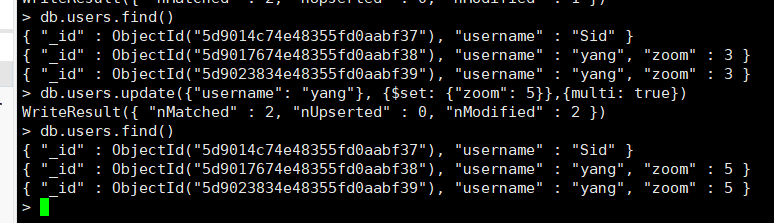
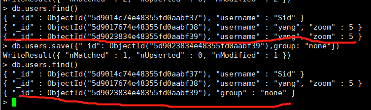

### 1.centos 下 mongodb 的安装

[https://www.cnblogs.com/flying1819/articles/9035408.html](https://www.cnblogs.com/se7enjean/p/10991466.html)

### 2.mongodb 的启动

[https://www.cnblogs.com/se7enjean/p/10991466.html](https://www.cnblogs.com/se7enjean/p/10991466.html)

1） 以参数形式启动  
mongod --dbpath /data/db --port 27017 --fork --logpath /var/log/mongodb.log
2）连接 mongodb
mongo 127.0.0.1:127017

> mongodb 一个集合可以存储不同的数据结构，如下图所示
> 

- show dbs 展示数据库
- use 数据库名 直接切换到当前数据库包括不存在的数据（直接创建）  
  新数据真正创建完成是在数据中的一个集合中插入了一条数据如下图所示
  
- show collections 展示集合
- db.users.find() 查看集合中的数据（users 为集合名）
- db.users.find({"username": "yang"}) 根据条件查询
- db.users.insert({"username": "yang"}) 插入数据（其中插入的数据为 json 对象）
- db.users.find().count() 查看当前集合的数据数目
- db.users.update(arg1, arg2, arg3)  
  arg1 要修改的数据 {"ussername":"yang"}  
  arg2 修改后的数据 {\$set: {"group": name}}  
  arg3 是否修改多行，默认为 false {multi: true}  
  
- db.users.save(arg1) 修改数据与 update 不同的是只有一个参数，必须传入\_id,传入的值会完全替换原来的数据如下图所示  
  db.users.save({"\_id": ObjectId("5d9023834e48355fd0aabf39"),group: "none"})  
  
- db.users.remove(arg1, arg2) 删除数据  
  arg1 需要删除的数据条件，如 包含{"username": "yang"}的数据  
  arg2 是否删除单行数据默认为 false，也就是默认为删除多行，改为 true 后删除匹配到的数据第一条数据  
  db.users.remove({}) 删除所有数据
- db.users.drop() remove 方法删除不了带有索引的数据，因此可以用 drop 方法进行全部删除
