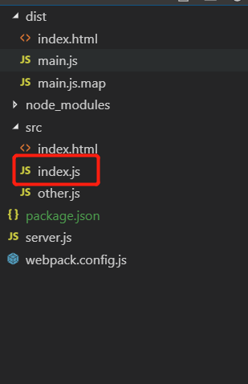

webpack 内部自带了express 所以直接使用
参考网址：[https://webpack.js.org/configuration/dev-server/#devserverproxy](https://webpack.js.org/configuration/dev-server/#devserverproxy)

### 1.通过devServer中的proxy到express服务器上

**文件夹图**



新建一个**server.js**，然后通过vscode中的runcode启动
```javascript
const express = require('express');
const app = express();

app.get('/api/user',(req,res) => {
  res.json({name: "Tommy-Yang"});
}).listen(3000);

```

**index.js**
```javascript
//发起一个get请求
let xhr = new XMLHttpRequest();
xhr.open('GET','/api/user',true);
xhr.onload = function () {
  console.log(xhr.response);
};

xhr.send();

```

**webpack.config.js**
```javascript
module.exports = {
  //...
  devServer: {
    proxy: {
      '/api': 'http://localhost:3000' //匹配api的接口都代理到3000端口上
    }
  }
};
```

上述情况是后端接口格式是以'/api/*'开头的，但是有时候后端提供的接口并没有带/api,而我们自己又想带上/api,所以，我们需要更改一下webpack.config.js文件,代码如下所示

**server.js**
```javascript
const express = require('express');
const app = express();

app.get('/user',(req,res) => {
  res.json({name: "Tommy-Yang"});
}).listen(3000);

```

**webpack.config.js**
```javascript 
module.exports = {
  //...
  devServer: {
    proxy: {
      '/api': {
        target: 'http://localhost:3000',
        pathRewrite: {'^/api' : ''}
      }
    }
  }
}
//这里我们通过pathRewrite将所有/api重写为空
```


### 2.后端没有接口，前端单纯想mock数据

可以利用devServer的钩子before，参考网址：[https://webpack.js.org/configuration/dev-server/#devserverbefore](https://webpack.js.org/configuration/dev-server/#devserverbefore)


**webpack.config.js**
```javascript
module.exports = {
  //...
  devServer: {
    before: function(app, server) {
      app.get('/user', function(req, res) {
        res.json({ name: 'Tommy-Yang' });
      });
    }
  }
};
```


