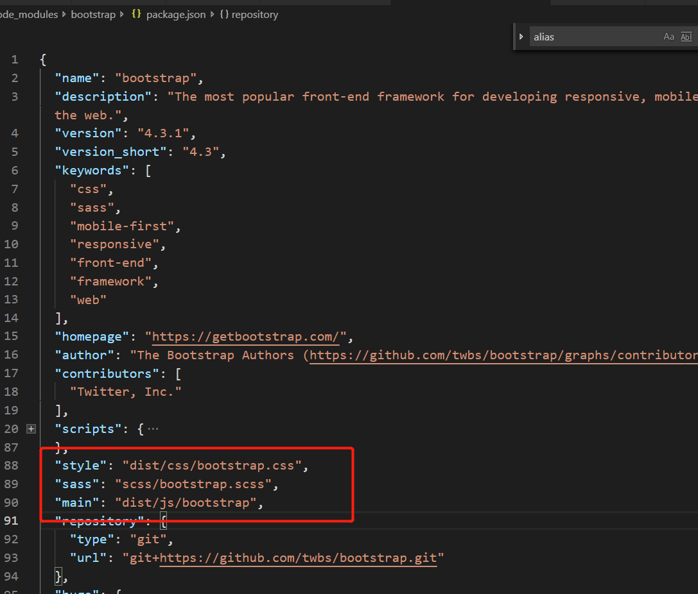

我们在引包的时候，webpack默认的会在node_modules里找，然后在往上一层找，直到找到为止。  
可以设置resovle的属性值来设置webpack解析第三方包的规则，常用的属性有以下属性,参考网址[https://webpack.js.org/configuration/resolve](https://webpack.js.org/configuration/resolve)
```javascript 
module.exports = {
  //...
  resolve: { //解析第三方包
    modules: [path.resolve('node_modules')],//指定文件夹开始解析包，可以是多个文件夹
    alias: { //别名，给引入的包用别名表示
      bootstrap: 'boostrap/dist/css/bootstrap.css'
    },
    mainFields: ['style','main'],//表示先启动包中的package.json文件哪个字段，顺序是从左到右
    extensions: ['.js','.css','.json','.vue']//自动解析引入包的扩展名，从左到右依次解析
  }
}
```  

下面我就说说这些属性应用的一些场景。
**1）resolve.alias**
当我们引入包需要，有可能觉得我们引入的包的名字比较长或者我们用的比较多，我们可以给这个包起个别名  
比如说：
**index.js**
```javascript
import 'boostrap/dist/css/bootstrap.css'
```
//引入bootstrap的css文件，这个名字有点长,我们在alias配置如下所示
```javascript
//webpack.js
module.exports = {
  //...
  resolve: { //解析第三方包
    modules: [path.resolve('node_modules')],//指定文件夹开始解析包，可以是多个文件夹
    alias: { //别名，给引入的包用别名表示
      bootstrap: 'boostrap/dist/css/bootstrap.css'
    }
  }
}


//index.js
import 'boostrap'
```

这样我们引入这个别名了

**2）resolve.mainFields**
先看一张bootstrap包里面的package.json的截图  
  
我们在引入包import 'boostrap'（这里是正常引用，没有起别名） ，webpack会先启动main字段，如果我们想只启动css，我们可以修改mainFields属性，改变启动顺序
```javascript
module.exports = {
  //...
  resolve: { //解析第三方包
    modules: [path.resolve('node_modules')],
  /*   alias: { 
      bootstrap: 'boostrap/dist/css/bootstrap.css'
    }, */
    mainFields: ['style','main']//先启动style
  }
}
```

**3）resolve.extensions**
有时候我们在引入包的时候，我们不想写扩展名，一般来说，webpack在没有写扩展名的包，会自动找.js后缀，其他的它不会去找。  
下面有个场景，我们想引入style.css，但不想写扩展名
```javascript
//style.css
body {
  background: yellow;
}

//index.js
import 'style';

//webpack.config.js
module.exports = {
  //...
 extensions: ['.js','.css','.json','.vue'] //会先解析以js结尾的文件，如果没有则继续往后解析
  }
}
```