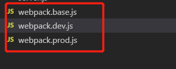

有些时候我们区分开发环境和生产环境，我们可以用webpack-merge插件  
  
我们可以把公共的部分放入webapck.base.js中，webpack.dev.js放开发模式的webpack设置，webpack.prod.js放生产模式的webpack设置    

参考文章； [https://www.npmjs.com/package/webpack-merge](https://www.npmjs.com/package/webpack-merge)

***用法***
先安装
```javascript
npm i -D webpack-merge
```
**webpack.dev.js**
```javascript
let {smart} = require('webpack-merge');
let base = require('./webpack.base.js');

module.exports = smart(base, {
  mode: 'development',
  //....开发模式需要设置的内容
});
```
webpack.prod.js和上面的写法差不多

启动开发模式，可以用 npm run build -- --config webpack.dev.js