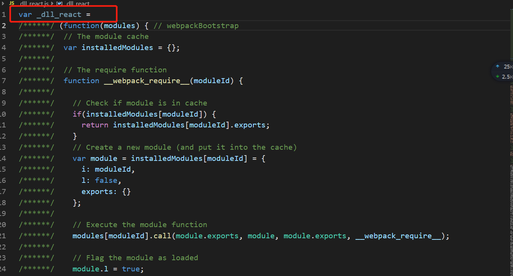
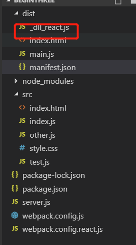
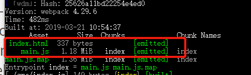
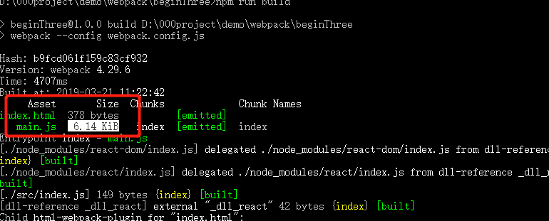

### **1)module.noParse**  
比如说我们要在入口文件中引入jquery，webpack默认会解析jquery中的其他依赖项，从而降低打包性能，因此可以设置noParse：/jquery/,告诉webpack不去解析jqeury中的依赖关系    
参考文章 ：[https://webpack.js.org/configuration/module/#modulenoparse](https://webpack.js.org/configuration/module/#modulenoparse)

```javascript
//入口文件index.js
import jquery from 'jquery'


//webpack.config.js
module.exports = {
  module: {
    noParse: /jquery/ //告诉webpack不去解析jquery中的依赖关系
  }
}
```

### **2)rule.exclude和rule.include**  
参考文章：[https://webpack.js.org/configuration/module#ruleexclude](https://webpack.js.org/configuration/module#ruleexclude)  
***webpack.config.js***
```javascript
module.exports = {
  module: {
    rules: [
      {
        test: /\.js$/,
        use: {
          loader: 'babel-loader',
          options: {
            presets: ['@babel/preset-env'],
            plugins: ['@babel/plugin-proposal-class-properties']
          },
        exclude: /node_modules/, //不查找node_modules目录，即排除
        include: path.resolve('src') //只查找src目录下的js，即包含
        }
      }
    ]
  }
}
```  

### **3)IgnorePlugin**  
参考文章：[https://webpack.js.org/plugins/ignore-plugin/](https://webpack.js.org/plugins/ignore-plugin/)    
在moment插件中所有locales文件夹都会被引用，我们可以通过只引入我们需要的locale来优化打包性能。如下图所示
  
   
因为moment.js中使用上了上图中一句话
```javascript
require('./locale/' + name);
```
因此我们webpack.config.js中需要配置两个参数
```javascript
module.exports = {
  plugins: [
    new webpack.IgnorePlugin({
      resourceRegExp: /^\.\/locale$/,
      contextRegExp: /moment$/
    })//忽略以moment结尾的目录下的locale文件夹
  ]
}
```

***index.js***
```javascript
import moment from 'moment';

//手动引入所需要的语言
import 'moment/locale/zh-cn';

moment.locale('zh-cn'); //设置语言

let r = moment().endOf('day').fromNow();
console.log(r);
```

### **4)创建动态链接库即利用dllPlugin创建manifest.json文件**  
我们在打包的时候


以react为例
**先安装配置react所需的包**  
```javascript
npm i -D react react-dom @babel/preset-react
```
webpack需要配置如下  
**src/index.html**
```javascript
<!DOCTYPE html>
<html lang="en">
<head>
  <meta charset="UTF-8">
  <meta name="viewport" content="width=device-width, initial-scale=1.0">
  <meta http-equiv="X-UA-Compatible" content="ie=edge">
  <title>Document</title>
</head>
<body>
 <div id="app"></div>
</body>
</html>
```
**src/index.js**
```javascript
import React from 'react';
import ReactDom from 'react-dom';


ReactDom.render(<h1>jsx</h1>,document.getElementById('app'));
```

**webpack.config.js**
```javascript
module.exports = {
  //...
   module: {
    rules: [
      {
        test: /\.js$/,
        use: {
          loader: 'babel-loader',
          options: {
            presets: ['@babel/preset-env','@babel/preset-react'],
            plugins: ['@babel/plugin-proposal-class-properties']
          }
        },
        exclude: /node_modules/
      }
 }
}
```

上面的代码就是设置的react的基本配置，我再执行npm run build打包就会发现，打包的结果非常大。这个时候我们就需要动态连接查询，将 react 和 react-dom单独打包出去

因此我们单独新建一个webpack.config.react.js文件    
DllPlugin文章链接：[https://webpack.js.org/plugins/dll-plugin/](https://webpack.js.org/plugins/dll-plugin/)  
```javascript
let path = require('path');
let webpack = require('webpack');

module.exports = {
  mode: 'development',
  entry: {
    react: ['react','react-dom']
  },
  output: {
    filename: '_dll_[name].js',
    path: path.resolve(__dirname,'./dist'),
    library: '_dll_[name]',//将打包的结果用变量接收或者直接暴露
    //libraryTarget: 'var'
  },
  plugins: [
    new webpack.DllPlugin({
      name: '_dll_[name]', //name与library名字一致
      path: path.resolve(__dirname,'dist','manifest.json')
    })
  ]
}
//DllPlugin实际上是生成一个maifest.json的目录文件
```
output.library的文章链接为[https://webpack.js.org/configuration/output#outputlibrary](https://webpack.js.org/configuration/output#outputlibrary) 设置后结果图如下    
   

然后执行npx webpack --config webpack.config.react.js,生成_dll_react.js文件,如下图所示  



在src/index.html引入_dll_react.js
```javascript 
<!DOCTYPE html>
<html lang="en">
<head>
  <meta charset="UTF-8">
  <meta name="viewport" content="width=device-width, initial-scale=1.0">
  <meta http-equiv="X-UA-Compatible" content="ie=edge">
  <title>Document</title>
</head>
<body>
 <div id="app"></div>
 <script src="/_dll_react.js"></script>
</body>
</html>
```


最后一步在webapck.config.js中设置DllReferencePlugin，其目的是在解析引入的包的时候动态查询manifest.json文件中能否查询到react，查到了就不打包，没查到就执行打包     
**webpack.config.js**
```javascript
module.exports = {
  //...
   plugins: [
    new HtmlWebpackPlugin({
      template: './src/index.html',
      filename: 'index.html'
    }),
    new webpack.DllReferencePlugin({
      manifest: path.resolve(__dirname,'dist','manifest.json')
    })
}
```

最后执行npm run build执行打包会发现打包之后的文件大小比原来小了很多 
没有设置dllPlugin之前   
  

设置之后  
  
