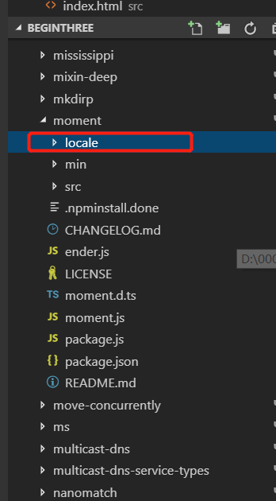
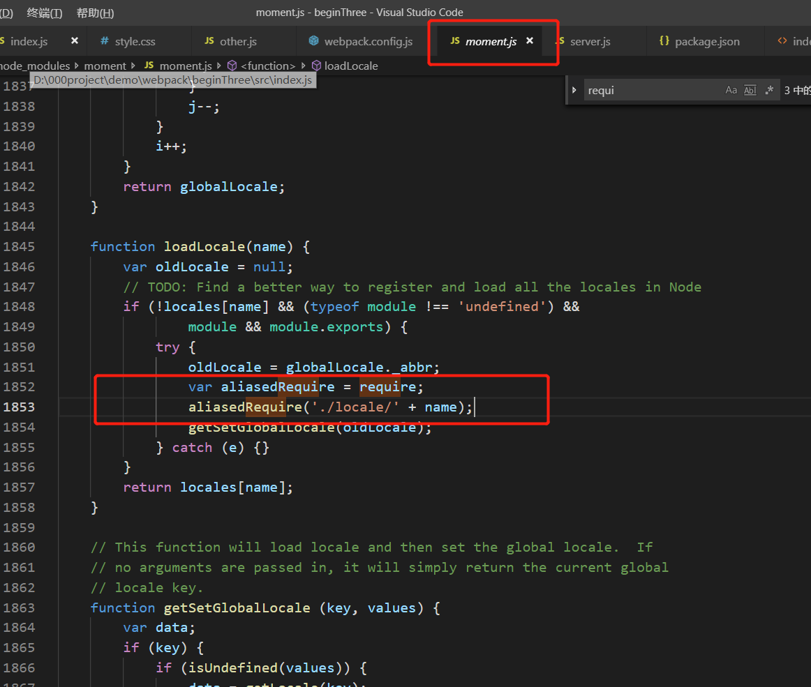

**1)module.noParse**  
比如说我们要在入口文件中引入jquery，webpack默认会解析jquery中的其他依赖项，从而降低打包性能，因此可以设置noParse：/jquery/,告诉webpack不去解析jqeury中的依赖关系    
参考文章 ：[https://webpack.js.org/configuration/module/#modulenoparse](https://webpack.js.org/configuration/module/#modulenoparse)

```javascript
//入口文件index.js
import jquery from 'jquery'


//webpack.config.js
module.exports = {
  module: {
    noParse: /jquery/ //告诉webpack不去解析jquery中的依赖关系
  }
}
```

**2)rule.exclude和rule.include**  
参考文章：[https://webpack.js.org/configuration/module#ruleexclude](https://webpack.js.org/configuration/module#ruleexclude)  
***webpack.config.js***
```javascript
module.exports = {
  module: {
    rules: [
      {
        test: /\.js$/,
        use: {
          loader: 'babel-loader',
          options: {
            presets: ['@babel/preset-env'],
            plugins: ['@babel/plugin-proposal-class-properties']
          },
        exclude: /node_modules/, //不查找node_modules目录，即排除
        include: path.resolve('src') //只查找src目录下的js，即包含
        }
      }
    ]
  }
}
```  

**3)IgnorePlugin**  
参考文章：[https://webpack.js.org/plugins/ignore-plugin/](https://webpack.js.org/plugins/ignore-plugin/)    
在moment插件中所有locales文件夹都会被引用，我们可以通过只引入我们需要的locale来优化打包性能。如下图所示
  
   
因为moment.js中使用上了上图中一句话
```javascript
require('./locale/' + name);
```
因此我们webpack.config.js中需要配置两个参数
```javascript
module.exports = {
  plugins: [
    new webpack.IgnorePlugin({
      resourceRegExp: /^\.\/locale$/,
      contextRegExp: /moment$/
    })//忽略以moment结尾的目录下的locale文件夹
  ]
}
```

***index.js***
```javascript
import moment from 'moment';

//手动引入所需要的语言
import 'moment/locale/zh-cn';

moment.locale('zh-cn'); //设置语言

let r = moment().endOf('day').fromNow();
console.log(r);
```


