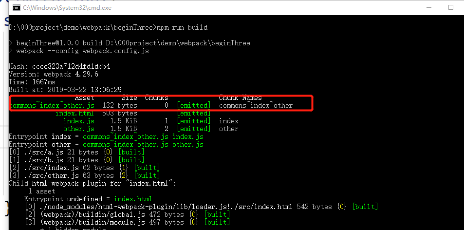

从webpack4.0版本以后，CommonsChunkPlugin被删除，取而代之的是optimization.splitchunks。optimization.splitchunks相关参数可以参考下面的链接：[https://webpack.js.org/plugins/split-chunks-plugin/](https://webpack.js.org/plugins/split-chunks-plugin/)  

splitChunks主要用于抽离公共模块和第三方模块  
### 1)例子1：为多入口文件共享公共代码创建commons chunk  
我们在src目录新建两个公共代代码a.js ,b.js文件，  
然后再新建index.js和ohter.js分别同时引入a.js和b.js
**index.js**
```javascript
import './src/a.js';
import './src/b.js';
console.log('index.js-----');
```
**other.js**
```javascript
import './src/a.js';
import './src/b.js';
console.log('other.js-----');
```
**webpack.config.js**
```javascript
module.exports = {
  //...
  optimization: {
    splitChunks: {
      cacheGroups: {
        commons: {
          chunks: 'initial',//这表示将选择哪些块进行优化。当提供一个字符串时，有效值是all、async和initial。提供all可能特别强大，因为这意味着即使在异步块和非异步块之间也可以共享块。
          minSize: 0,//公共模块超过0个字节
          minChunks: 2 //至少被引入两次
        }
      }
    }
  }
};
```
最后我们重新npm run build打包一下,a.js和b.js会被打包到commons\~index\~other.js中，如下图所示  
  

### 2)例子2：创建一个包含node_modules中的库的vendors chunk
**webpack.config.js**
```javascript
module.exports = {
  //...
  optimization: {
    splitChunks: {
      cacheGroups: {
        vendors: {
          priority：1,//优先级
          test: /[\\/]node_modules[\\/]/,
          chunks: 'all'
        }
      }
    }
  }
};
```
这可能导致包含所有外部包的大块。建议只包含核心框架和实用程序，并动态加载其余依赖项


