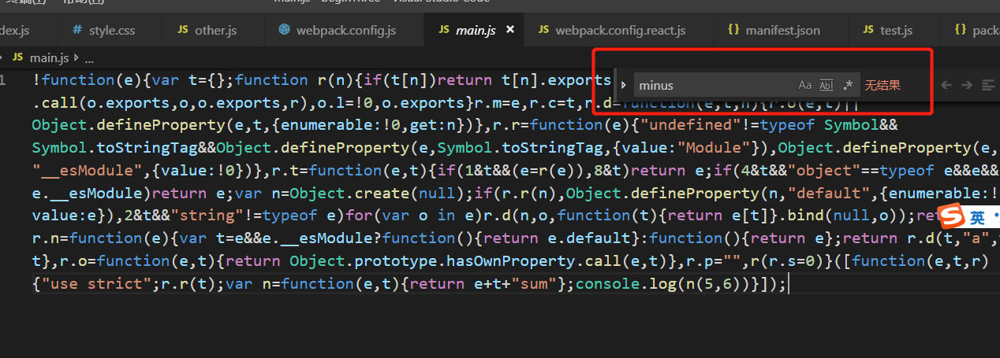
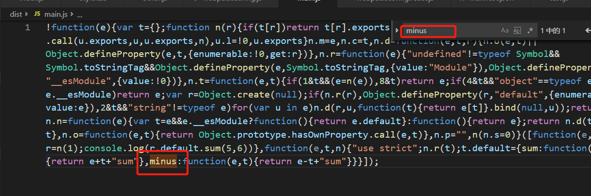

### 1)import 会在生产环境下自动去除没有用的代码,其实是一种tree-shaking，就是把没有用到的代码自动删除掉  
首先把webpack.config.js中mode改为production模式  
我们新建一个other.js  
**src/other.js**
```javascript
let sum = (a,b) => {
  return a + b + 'sum';
};
let minus = (a,b) => {
  return a - b + 'sum';
}

export default {
  sum,
  minus
}
```

**入口src/index.js文件中**
```javascript
import calc from './other.js';//import会自动删除没有用的代码

console.log(calc.sum(5,6));
```

因为上面只执行了sum方法，我们执行打包文件之后生成的dist/main.js中查找minus，会发现找不到截图如下   

****  
还有一种情况当我们使用require引入时  
**修改入口src/index.js文件中**
```javascript

let calc = require('./other.js');//export default导出，用require导入，会被放到default属性下

console.log(calc.default.sum(5,6));
```
  
  
我们会发现打包之后的结果里会找到我们没用到的minus方法。所以我们一般用import导入。


### 2)webapck打包会自动省略，自动简化  
  我就直接上代码  
  ```javascript
  let a = 1;
  let b = 2;
  let c = 3;
  console.log(a + b + c);
  ```
    
  如图所示，我们打包的结果直接计算出来了，在里面没有声明和赋值