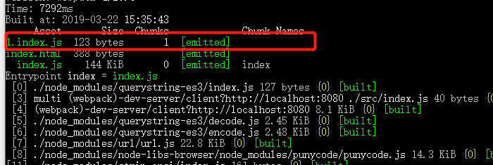

提供一个场景点击按钮后加载资源
**src/index.js**
```javascript
let button = document.createElement('button');
button.innerHTML = 'hello';
console.log(button);
button.addEventListener('click',function() {
  //import() es6草案中的语法 其实是通过jsonp实现动态加载 ，返回的是一个promise
  import('./source.js').then((data)=>{
    console.log(data.default);
  });
});
document.body.appendChild(button);
```
**资源文件src/source.js**
```javascript
export default 'Tommy-Yang';
```
在这之前需要配置@babel/plugin-syntax-dynamic-import插件  
**webpack.config.js**
```javascript
module.exports = {
  //...
    module: {
      rules: [
        {
          test: /\.js$/,
          use: {
            loader: 'babel-loader',
            options: {
              presets: ['@babel/preset-env','@babel/preset-react'],
              plugins: ['@babel/plugin-proposal-class-properties','@babel/plugin-syntax-dynamic-import']
            }
          },
          exclude: /node_modules/
        }
      ]
    }
}
```

我们打包之后会生成一个1.index.js文件，这个文件里放的是我们在source.js文件中导出的结果  
  

vue和react的懒加载也是通过此方式实现的
