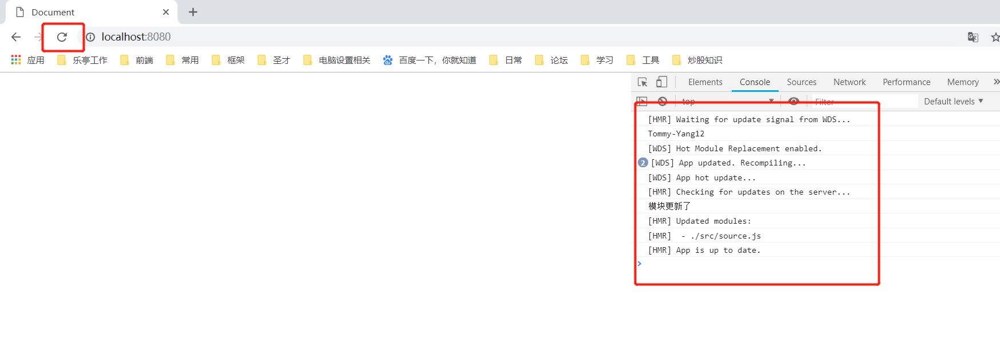

热更新官网配置说明的很清楚，可以参考官网来看，参考网址为[https://www.webpackjs.com/guides/hot-module-replacement/](https://www.webpackjs.com/guides/hot-module-replacement/)  
下面我写下基本配置  
**webpack.config.js**
```javascript
  const path = require('path');
  const HtmlWebpackPlugin = require('html-webpack-plugin');
  const CleanWebpackPlugin = require('clean-webpack-plugin');
+ const webpack = require('webpack');

  module.exports = {
    entry: {
+      app: './src/index.js'
    },
    devtool: 'inline-source-map',
    devServer: {
      contentBase: './dist',
+     hot: true  //开启热更新
    },
    plugins: [
      new CleanWebpackPlugin(['dist']),
      new HtmlWebpackPlugin({
        title: 'Hot Module Replacement'
      }),
+     new webpack.NamedModulesPlugin(), //打印更新的模块路径
+     new webpack.HotModuleReplacementPlugin() //热更新插件
    ],
    output: {
      filename: 'index.js',
      path: path.resolve(__dirname, 'dist')
    }
  };
```
**src/source.js**
```javascript
export default 'Tommy-Yang123';
```


**src/index.js**
```javascript
import str from './source.js';
console.log(str);

//如果不添加下面的话，热更新就不会有作用，页面会强制重刷更新
+ if (module.hot) {
+   module.hot.accept('./source.js', function() { //当接收的路径./source.js更新了，就执行回调
+     console.log('Accepting the updated printMe module!');
+   })
+ }
```
最后通过命令npm run dev启动服务dev-server。这个时候要重新刷新浏览器，然后更改source.js文件，浏览器不会强制重刷更新，打印结果会在控制台显示出source.js模块更新了。  
所谓强制重刷更新就是浏览器左上角会强制刷新，转动一下，而热更新浏览器左上角的刷新图标并不会转动。  

